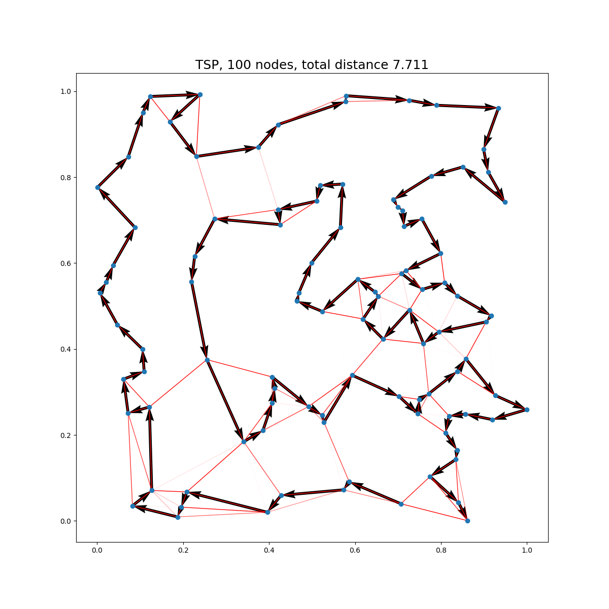

# GNN-for-CO

This repositorty contains code for the testing, verification and reimplimentation for [Attention, Learn to Solve Routing Problems!](https://arxiv.org/abs/1803.08475), [An Efficient Graph Convolutional Network Technique for the Travelling Salesman Problem](https://arxiv.org/abs/1906.01227), and [Deep Policy Dynamic Programming](https://arxiv.org/abs/2102.11756)




### Deep Policy Dynamic Programming

Run the following to setup a the environment on AWS Deep Learning AMI (Ubuntu 18.04) Version 43.0 : 
```bash

# Install Python 3.8
sudo apt install python3.8

# Download environment setup script
wget https://raw.githubusercontent.com/salujajustin/GNN-for-CO/main/scripts/dpdp-setup.sh

# Change permissions and run
chmod +x dpdp-setup.sh
./dpdp-setup.sh
```


## Acknowledgements
This repository was built upon the excellent repositories of [graph-convnet-tsp](https://github.com/chaitjo/graph-convnet-tsp) by Chaitanya K. Joshi and [dpdp](https://github.com/wouterkool/dpdp) by Wouter Kool.
